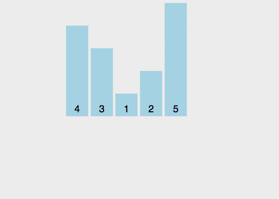

# Insertion Sort

## Straight Insertion Sort

- Description:
    + The list is divided into 2 parts: **sorted** and **unsorted**.
    + In each pass, the fisrt element of the unsorted sublist is **inserted** into the sorted sublist.  
    
      
- Efficiency: O(n2)

## Shell Sort

# Selection Sort

## Straight Selection Sort

- Description:
    + The list is divided into 2 parts: **sorted** and **unsorted**.
    + In each pass, in the unsorted sublist, the smallest element is **selected** and **exchanged** with the first element.  
    
      
- Efficiency: O(n2)

## Heap Sort

- Description:
    + The unsorted sublist is organized into a **heap**.
    + In each pass, in the unsorted sublist, the largest element is **selected** and **exchanged** with the last element.
    + The heap is **reheaped**.
- Efficiency: O(nlog2n)

# Exchange Sort

## Bubble Sort

- Description:
    + The list is divided into 2 parts: **sorted** and **unsorted**.
    + In each pass, the smallest element is **bubbled** from the unsorted sublist and moved to the sorted list.  
    
      
- Efficiency: O(n2)

# Divide-and-Conquer

## Quick Sort

## Merge Sort
