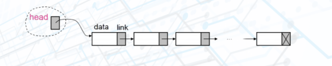
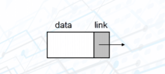
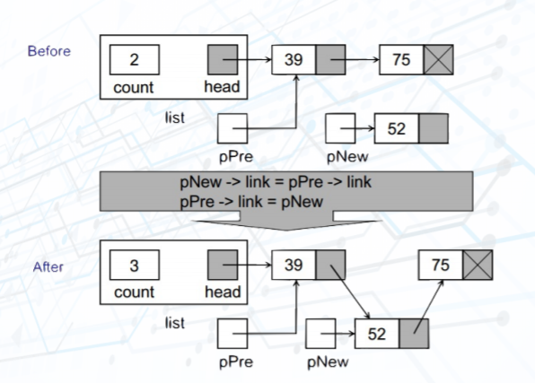
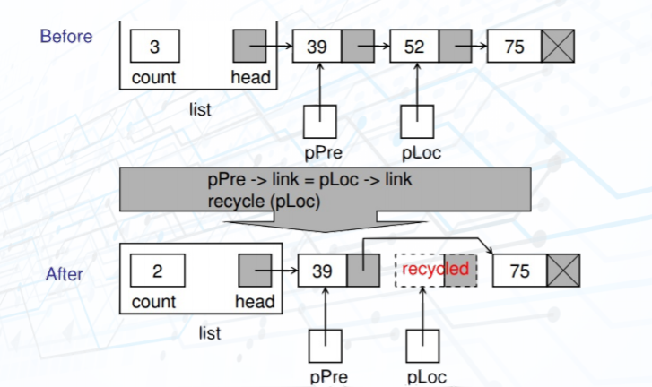
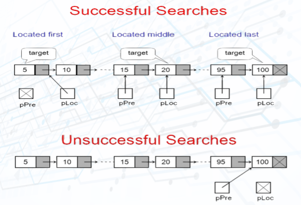
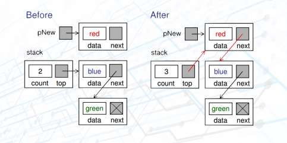
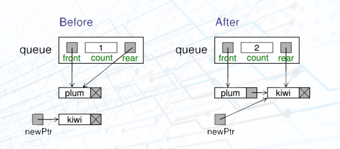
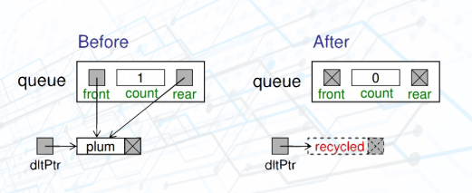

## Single linked list:

- Definition: A linked list is an ordered collection of data in which each element contains the location of the next element.  

- Node:
    + The elements in a linked list are called **nodes**
    + A **node** in a linked list is a structure that has at least two fields: the data and the address of the next node.  

- Methods:
    + Add node:  
    
      

    + Delete node:  
    
      

    + Searching:  
    
      
    
    + Reverse list:      
    
      

## Stack:

- Definition: A stack of elements of type T is a finite sequence of elements of T, in which all insertions and deletions are restricted to one end, called the top. Stack is a Last In - First Out (LIFO) data structure. (LIFO: The last item put on the stack is the first item that can be taken off.)

- Methods:
    + Push:  
    
      

    + Pop:  
    
      

## Queue:

- Definition: A queue of elements of type T is a finite sequence of elements of T, in which data can only be inserted at one end called the rear, and deleted from the other end called the front. Queue is a First In - First Out (FIFO) data structure. (FIFO: The first item stored in the queue is the first item that can be taken out.)

- Methods:
    + Enqueue:  
    
      

    + Dequeue:  
    
      

