## Single linked list:

- Definition: A linked list is an ordered collection of data in which each element contains the location of the next element.  

- Node:
    + The elements in a linked list are called **nodes**
    + A **node** in a linked list is a structure that has at least two fields: the data and the address of the next node.  
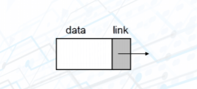

- Methods:
    + Add node:  
    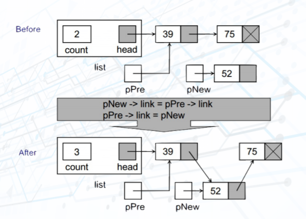
      

    + Delete node:  
    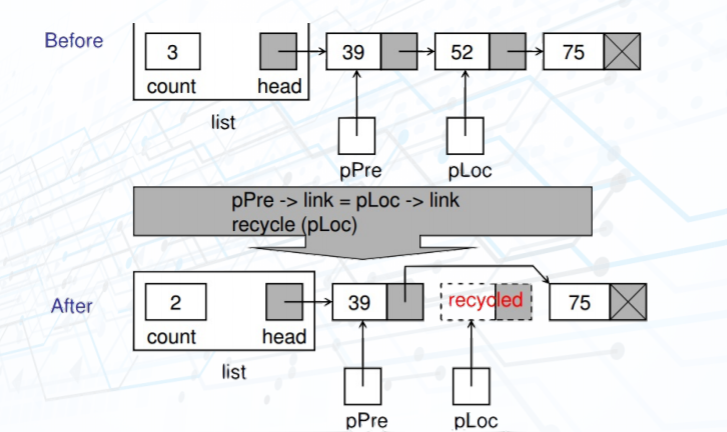
      

    + Searching:  
    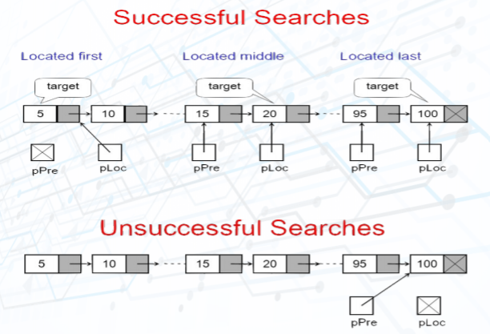
      
    
    + Reverse list:      
    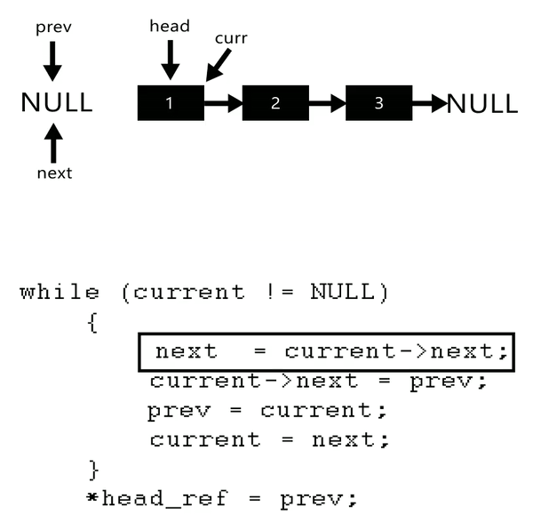
      
- Applications:
    + Implement stack, queue, graphs, ...
    + Dynamic list
    + ...

## Stack:

- Definition: A stack of elements of type T is a finite sequence of elements of T, in which all insertions and deletions are restricted to one end, called the top. Stack is a Last In - First Out (LIFO) data structure. (LIFO: The last item put on the stack is the first item that can be taken off.)
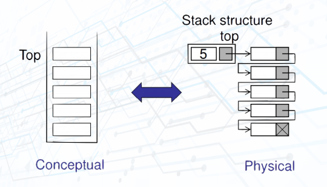

- Methods:
    + Push:  
    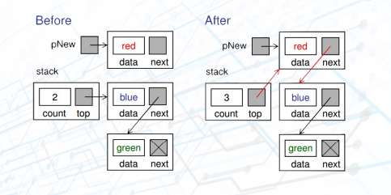
      

    + Pop:  
    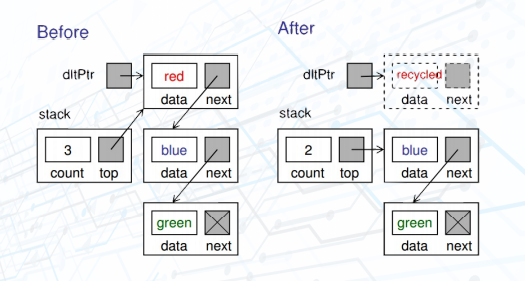
      

- Applications:
    + Reversing data items (Reverse a list, convert decimal to binary, ...)
    + Parsing (brackets parse, ...)
    + Postponement of processing data items (Infix to Postfix Transformation, Evaluate a Postfix Expression, ...)
    + Backtracking

## Queue:

- Definition: A queue of elements of type T is a finite sequence of elements of T, in which data can only be inserted at one end called the rear, and deleted from the other end called the front. Queue is a First In - First Out (FIFO) data structure. (FIFO: The first item stored in the queue is the first item that can be taken out.)
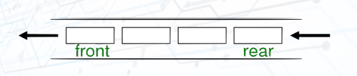

- Methods:
    + Enqueue:  
    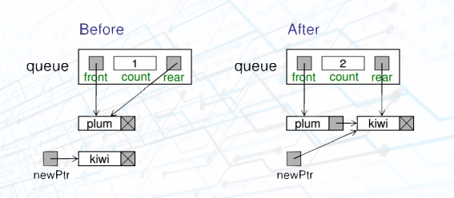
      

    + Dequeue:  
    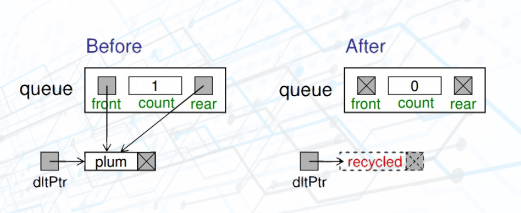
      

- Applications:
    + Polynomial Arithmetic
    + Categorizing Data
    + Evaluate a Prefix Expression
    + Redix Sort
    + Queue Simulation

## Tree
- Definition: A tree consists of finite set of elements, call **nodes**, and a finite set of directed lines, called **branches**, that connect the nodes.
- Basic Tree Concepts:
    + Degree of a node: the number of branches associated with the node.
    + Indegree branch: directed branch toward the node.
    + Outdegree branch: directed branch away from the node.
    + The first node is called the **root**.
    + Indegree of the root = 0, the indegree of another = 1.
    + Out degree of a node = 0 or 1 or more.
- Terms:
    + A **root** is the first node with an indegree of zero.
    + A **leaf** is any node with an outdegree of zero.
    + A **internal node** is not a root or a leaf.
    + A **parent** has an outdegree greater than zero.
    + A **child** has an indegree of one -> a internal node is both a parent of a node and a child of another one.
    + **Siblings** are two or more nodes with the same parent.
    + For a given node, an **ancestor** is any node in the path from the root to the node.
    + For a give node, an **descendent** is ant node in the paths from the node to a leaf.
    + A **path** is a sequence of nodes in which each node is adjacent to the next node.
    + The **level** of a node is its distance from the root -> Siblings are always at the same level.
    + The **height** of a tree is the level of the leaf in the longest path from the root plus 1.
    + A **subtree** is any connected structure below the root.
      
    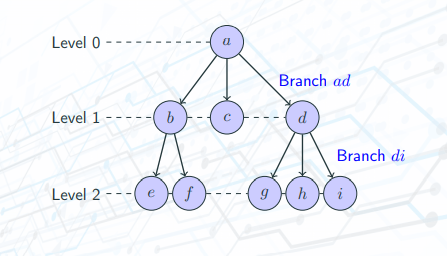
      
- Applications:
    + Representing hierarchical data.
    + Storing data in a way that makes it easily searchable.
    + Representing sorted lists of data.
    + Network routing algorithms.

## Binary Search Tree (BST)
- Definition:
    A **binary search tree (BST)** is a binary tree with the following properties:
    + All items in the left subtree are less than the root.
    + All items in the right subtree are greater than or equal to the root.
    + Each subtree is itself a BST.  
    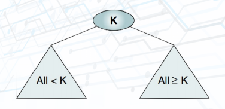
     

-> BST is a Binary tree that is sorted tree.

## AVL Tree
- Definition:
    **AVL Tree** is:
    + A Binary Search Tree,
    + in which the heights of the left and right subtrees of the root differ by at most 1, and
    + the left and right subtrees are again AVL trees.

    Discovered by G.M.**A**del'son-**V**el'skii and E.M.**L**andis in 1962.
    **AVL Tree** is a Binary Search tree that is balanced tree.

    A binary tree is an **AVL Tree** if
    + **Each node satisfies AST property**: key of the nodes is greater than the key of each node in its left subtree and is smaller than or equals to the key of each node in its right subtree.
    + **Each node satisfies balanced tree property**: the difference between the heights of the left subtree and right subtree of the node does not exceed one.
- Why AVL tree?
    + When data elements are inserted in a BST in sorted order: 1, 2, 3, ... BST becomes a degenerate tree. Search operation takes O(n), which is inefficient.
    + It is possible that affer a number of insert and delete operations, a binary tree may become unbalanced and inscrease in height.
    + AVL trees ensure that the complexity of search is O(log2(n)).

## Heap
- Definition:
    A **heap** (max-heap) is a binary tree structure with the following properties:
    + The tree is complete or nearly complete.
    + The key value of each node is **greater than or equal to** the key value in each of its descendents.

    A **min-heap** is a binary tree structure with the following properties:
    + The tree complete or nearly complete.
    + The key value of each node is **less than or equal to** the key value in each of its descendents.  

    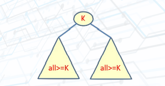

- Properties:
    + A complete or nearly complete binary tree.
    + If the height is *h*, the number of nodes N is between 2h-1 and 2h-1.
    + **Complete tree**: N = 2h - 1 when last level is full.
    + **Nearly complete**: All nodes in the last level are on the left.

    The relationship between a node and its children is fixed and can be calculated:
    + For a node located at index *i*, its children are found at:
        Left child: 2i + 1
        Right child: 2i + 2
    + The parent of a node located at index i is located at (i - 1)//2.
    + Given the index for a left child, j, its right sibling, if any, is found at j + 1. Conversely. given the index for a right child, k, ites left sibling, which must exist, is found at k - 1.
    + Given the size, N, of a complete heap, the location of the first left is N//2.
    + Given the location of the first left element, the location of last nonleaf element is 1 less.

- Methods:
    + **ReheapUp**: The **reheapUp** operation repairs a "broken" heap by **floating the last element up** the tree until it is in its correct location in the heap. Complexity O(log2n)

    + **ReheapDown**: The **reheapDown** operation repairs a "broken" heap by **push the root down** the tree until it is in its correct location in the heap. Complexity O(log2n)

    + **Build a heap**. Complexity O(nlog2n)

    + **Insert a Node into a Heap**. Complexity O(log2n)

    + **Delete a Node from a Heap**. Complexity O(log2n)

- Applications:
    + **selection algorithms**,
    + **priority queues**,
    + and sorting.
