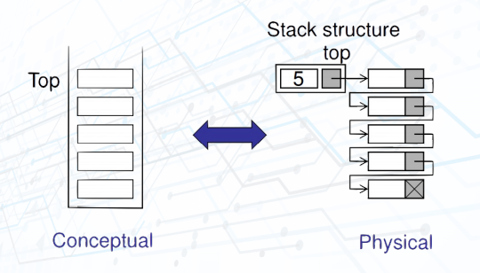
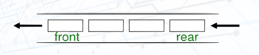
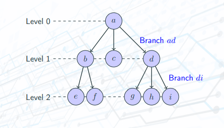

## Single linked list:

- Definition: A linked list is an ordered collection of data in which each element contains the location of the next element.  

- Node:
    + The elements in a linked list are called **nodes**
    + A **node** in a linked list is a structure that has at least two fields: the data and the address of the next node.  

- Methods:
    + Add node:  
    
      

    + Delete node:  
    
      

    + Searching:  
    
      
    
    + Reverse list:      
    
      
- Applications:
    + Implement stack, queue, graphs, ...
    + Dynamic list
    + ...

## Stack:

- Definition: A stack of elements of type T is a finite sequence of elements of T, in which all insertions and deletions are restricted to one end, called the top. Stack is a Last In - First Out (LIFO) data structure. (LIFO: The last item put on the stack is the first item that can be taken off.)

- Methods:
    + Push:  
    
      

    + Pop:  
    
      

- Applications:
    + Reversing data items (Reverse a list, convert decimal to binary, ...)
    + Parsing (brackets parse, ...)
    + Postponement of processing data items (Infix to Postfix Transformation, Evaluate a Postfix Expression, ...)
    + Backtracking

## Queue:

- Definition: A queue of elements of type T is a finite sequence of elements of T, in which data can only be inserted at one end called the rear, and deleted from the other end called the front. Queue is a First In - First Out (FIFO) data structure. (FIFO: The first item stored in the queue is the first item that can be taken out.)

- Methods:
    + Enqueue:  
    
      

    + Dequeue:  
    
      

- Applications:
    + Polynomial Arithmetic
    + Categorizing Data
    + Evaluate a Prefix Expression
    + Redix Sort
    + Queue Simulation

## Tree
- Definition: A tree consists of finite set of elements, call **nodes**, and a finite set of directed lines, called **branches**, that connect the nodes.
- Basic Tree Concepts:
    + Degree of a node: the number of branches associated with the node.
    + Indegree branch: directed branch toward the node.
    + Outdegree branch: directed branch away from the node.
    + The first node is called the **root**.
    + Indegree of the root = 0, the indegree of another = 1.
    + Out degree of a node = 0 or 1 or more.
- Terms:
    + A **root** is the first node with an indegree of zero.
    + A **leaf** is any node with an outdegree of zero.
    + A **internal node** is not a root or a leaf.
    + A **parent** has an outdegree greater than zero.
    + A **child** has an indegree of one -> a internal node is both a parent of a node and a child of another one.
    + **Siblings** are two or more nodes with the same parent.
    + For a given node, an **ancestor** is any node in the path from the root to the node.
    + For a give node, an **descendent** is ant node in the paths from the node to a leaf.
    + A **path** is a sequence of nodes in which each node is adjacent to the next node.
    + The **level** of a node is its distance from the root -> Siblings are always at the same level.
    + The **height** of a tree is the level of the leaf in the longest path from the root plus 1.
    + A **subtree** is any connected structure below the root.
      
    
      
- Applications:
    + Representing hierarchical data.
    + Storing data in a way that makes it easily searchable.
    + Representing sorted lists of data.
    + Network routing algorithms.

## Binary Search Tree (BST)
- Definition:
- Methods:
- Applications:

## AVL Tree
- Definition:
- Methods:
- Applications:

